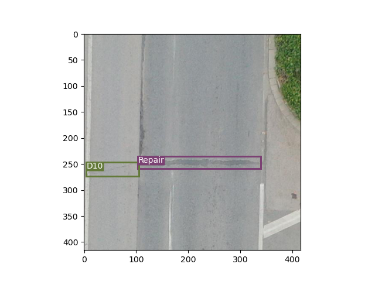
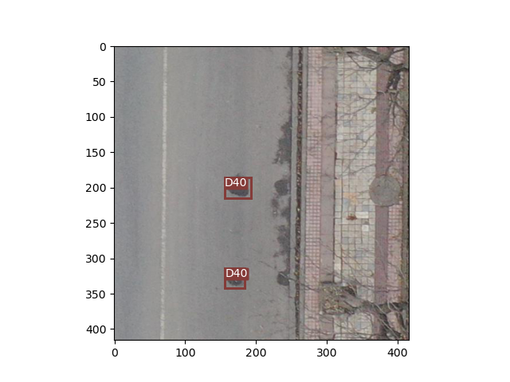
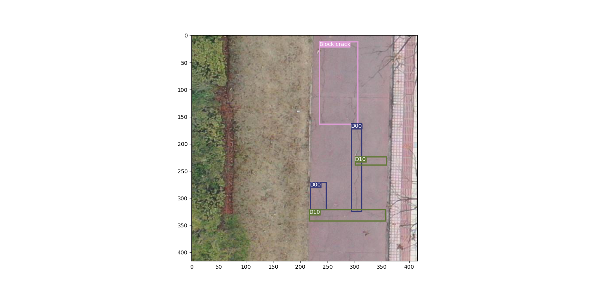

# Yolo V1 - Road Detection

## Dataset
The dataset used for this project is the [RDD2022 Dataset](https://github.com/sekilab/RoadDamageDetector). It is from 2022 paper [RDD2022: A multi-national image dataset for automatic Road Damage Detection](https://arxiv.org/abs/2209.08538).

It consists both drone and car images. In particular, I the `RDD2022_China_Drone` dataset for training and testing. It is fairly small, with only 2400 images. Nevertheless, it is a good dataset to start with.

### Classes
|  Class Name   |     Description      |
|--------------|-----------------------|
| D00          | Longitudinal Cracks   |
| D10          | Transverse Cracks     |
| D20          | Alligator Cracks      |
| D40          | Potholes              |
| Repair       | Repaired Crack               |
| Block crack  | Block Cracks          |

| Image 1 | Image 2 |
|---------|---------|
|  |  |

 

## Model
To start with, I used the [YoloV1](https://arxiv.org/abs/1506.02640) model. It is a single stage object detection model. It is simple and easy to implement. It is also fast, with 45 FPS on a Titan X GPU. At the time of, I only trained the model for 100 epochs, but it is already able to detect the road damages, albeit not very well.

 

I also tried to use the [YoloV3](https://arxiv.org/abs/1804.02767) model, still in progress...

